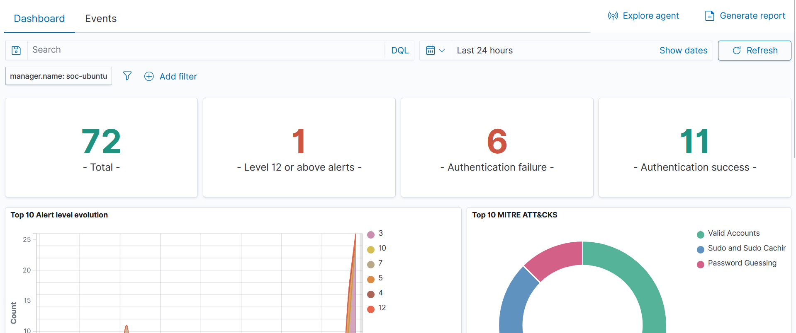
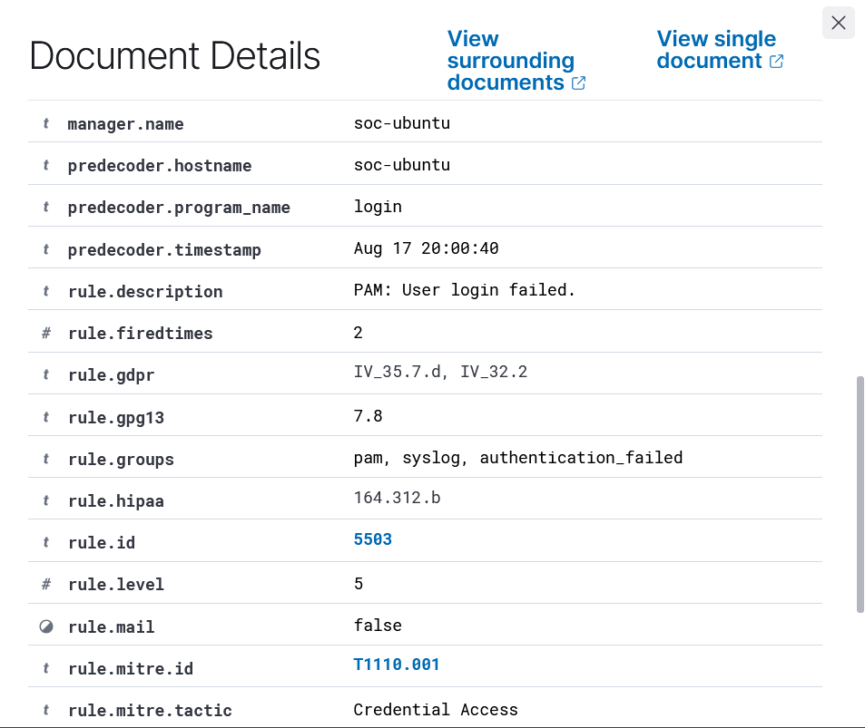
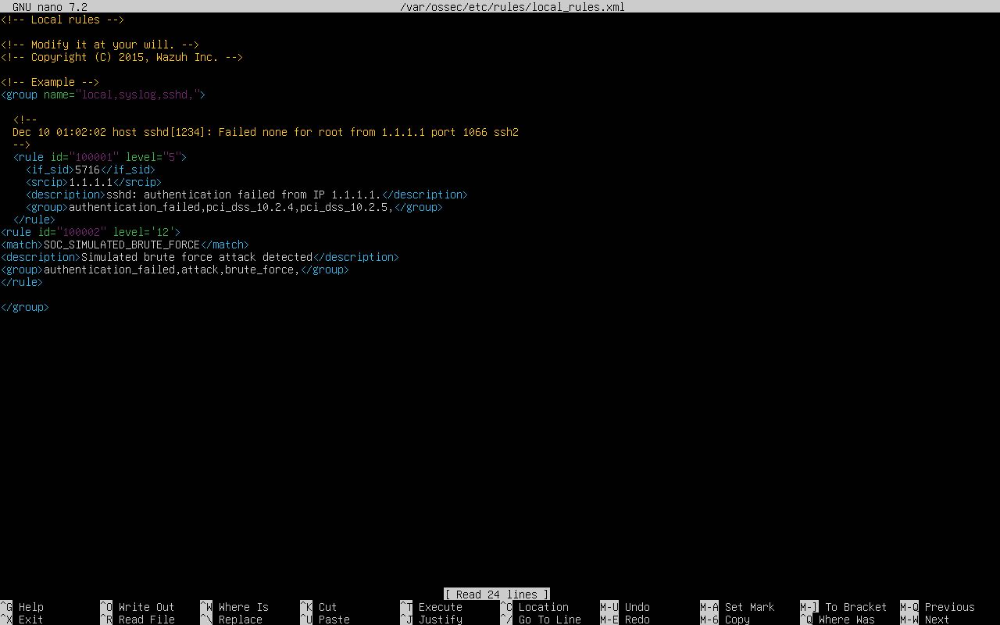
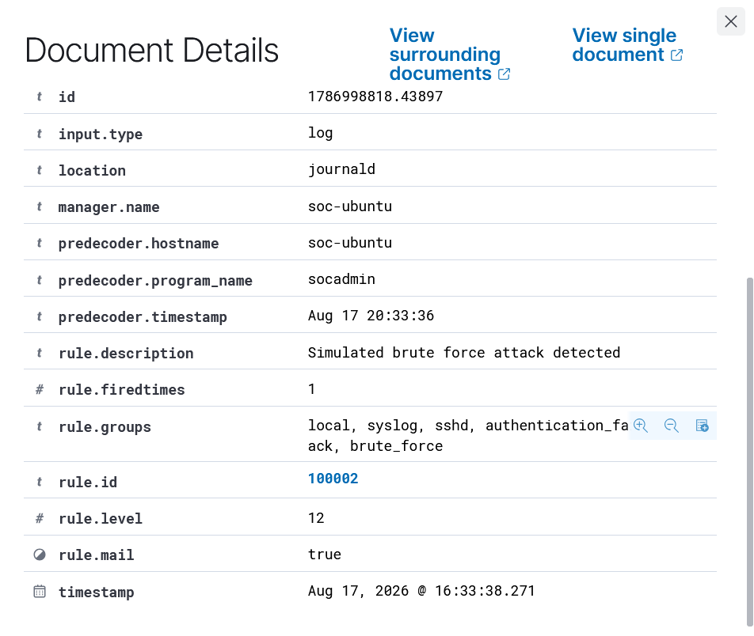
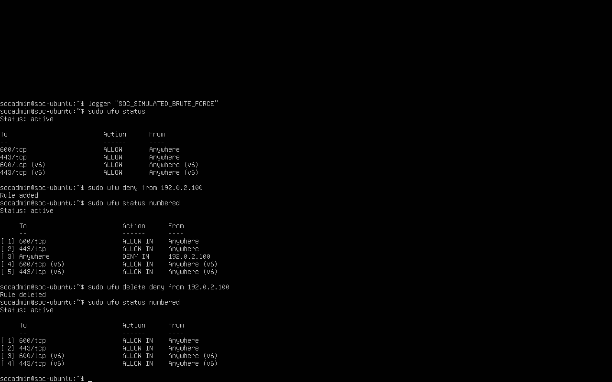
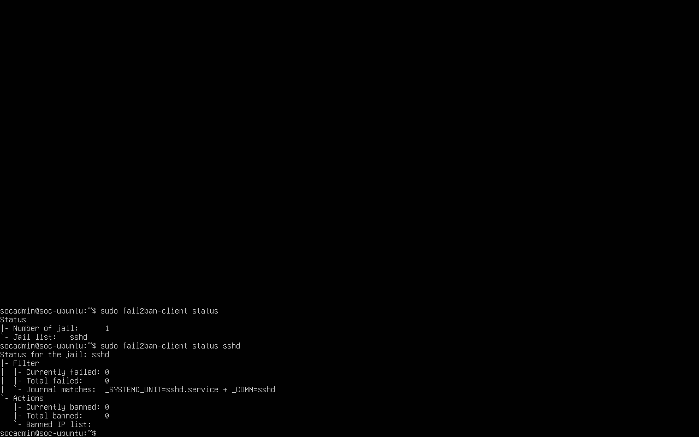

# Wazuh SOC Home Lab

A hands-on Security Operations Center (SOC) home lab built with Wazuh on Ubuntu Linux. This project demonstrates security monitoring, log analysis, custom detection rules, attack simulation, threat hunting, and incident containment.

## Lab Environment

- **SIEM:** Wazuh
- **Operating System:** Ubuntu Linux
- **Virtualization:** VirtualBox
- **Security Tools:** Wazuh, Fail2ban, UFW
- **Environment:** Local virtual SOC lab

## What I Implemented

- Deployed and configured a Wazuh SIEM environment
- Configured Ubuntu security monitoring and authentication logging
- Monitored failed authentication events
- Created a custom Wazuh brute-force detection rule
- Simulated brute-force activity for detection testing
- Investigated alerts and event details through the Wazuh Dashboard
- Used threat-hunting views to analyze authentication activity
- Configured Fail2ban for SSH protection
- Configured UFW firewall rules for containment testing
- Tested blocking and restoring network access
- Documented commands, configurations, alerts, and investigation results

## Security Scenarios

### Failed Authentication Detection

Simulated failed login activity and verified that Wazuh detected the authentication failures.

### Brute-Force Detection

Created a custom Wazuh rule to identify repeated authentication failures and generate a high-severity alert.

### Threat Hunting

Used the Wazuh Dashboard to investigate authentication activity and identify password-guessing behavior.

### Incident Containment

Used UFW to demonstrate blocking a suspicious IP address and restoring access after containment testing.

### SSH Protection

Configured and verified Fail2ban's SSH jail to provide automated protection against repeated authentication failures.

## Investigation & Detection

The lab demonstrates a basic SOC workflow:

1. Generate or identify suspicious activity
2. Collect security logs
3. Detect activity through Wazuh
4. Investigate the resulting alert
5. Identify the relevant security event
6. Apply containment controls
7. Verify the containment action
8. Restore access and document the result

## Screenshots

### Wazuh Dashboard Overview

### Failed Authentication Event

### Custom Brute-Force Detection Rule

### Brute-Force Alert

### Firewall Containment

### Fail2ban Configuration

## Skills Demonstrated

- SIEM monitoring
- Security event analysis
- Log analysis
- Threat hunting
- Authentication monitoring
- Detection engineering
- Incident response
- Incident containment
- Linux administration
- Firewall configuration
- SSH security
- Security automation

## Repository Contents

- `commands/` — Lab commands and configuration steps
- `screenshots/` — Evidence from the lab
- `README.md` — Project documentation

## Disclaimer

This project was performed in an isolated personal lab environment for educational and defensive security purposes.
